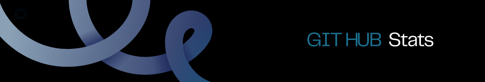

## Sobre mim 🌟

  

  
    Sou, uma entusiasta da programação de 20 anos. Atualmente cursando Análise e Desenvolvimento de Sistemas no IFSP e estou em busca do meu primeiro emprego na área.
    
    Sou organizada, acredito na importância da estrutura e planejamento para o sucesso de projetos. Me considero uma líder em formação, criativa, comunicativa e estou sempre buscando melhorar.
    
    Explore meus projetos e acompanhe essa jornada de programação e descobertas. 🚀
  

  

    
  
 

##

      
<table>
  <tr>
    <td  style="margin-botton: 20px;">
      
    </td>
    <td>
      
    </td>
  </tr>
</table>

<!--

  <a href:"https://https://github.com/Laysabernardes">
  
  
  
    

-->

## Tecnologias 🌟

<table>
  <tr>
    <td>
      
    </td>
    <td>
      

        
      

    </td>
  </tr>
</table>

<!--https://github.com/tandpfun/skill-icons#readme -->

## Contato 🌟

 
  
  
   

